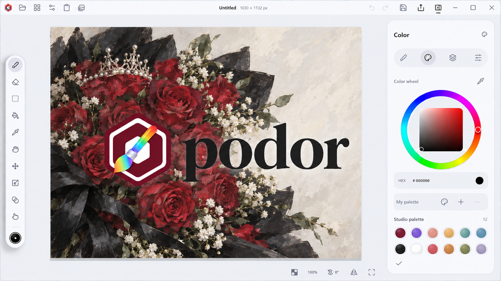
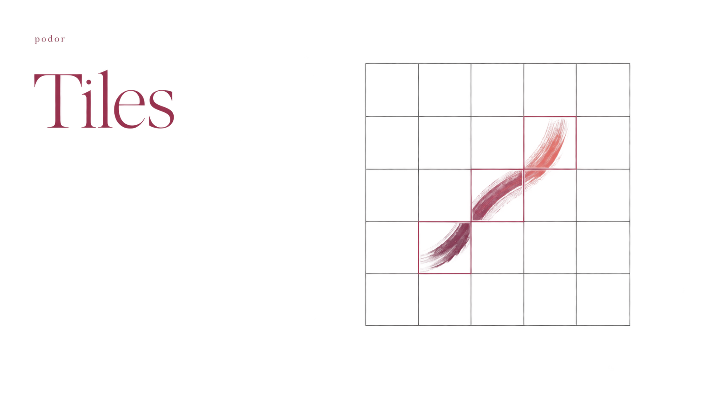
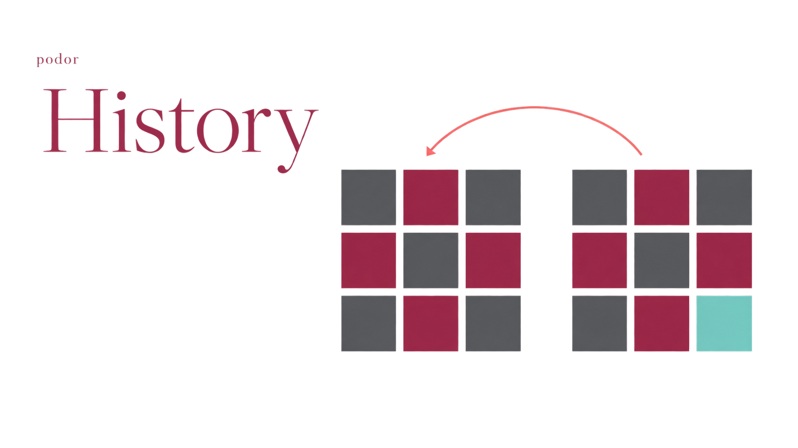

<p align="center">
  
</p>

<p align="center">
  <a href="https://gitee.com/Micheanl/podor/releases/latest"><b>下载 Windows 版</b></a>
  &nbsp; · &nbsp;
  <a href="https://github.com/Micheanl/podor/releases/latest">GitHub 下载</a>
  &nbsp; · &nbsp;
  <a href="https://gitee.com/Micheanl/podor/issues">反馈问题</a>
</p>

podor 是一款绘画与图像编辑软件，用 Rust 处理笔触和像素，用 Kotlin Compose 构建界面。目前主要开发 Windows 版。

### 画布上的事

- **画笔与颜色**，16 种内置笔刷，每支笔可调压感曲线、粗细和透明度压感，支持稳笔和笔尖随笔画转动，可调整笔尖、颗粒和间距，也可以导入自己的笔刷包。线性与径向渐变，可调整两端颜色、反转或淡出到透明色。
- **图层与编辑**，图片可导入为独立图层，选区可复制、剪切，剪贴板图片可粘贴为新图层。图层可缩放、旋转、翻转，确认前可预览，支持一步撤销。拖动缩略图排序，移动、复制和合并图层，锁定透明度与图层内容，8 种混合模式，矩形、椭圆和套索选区，填充、色彩调整和模糊。
- **画布与视图**，整幅作品可缩放，支持锁定比例、平滑和像素两种方式。画布可扩边或裁切，九宫格定位并预览边界，支持撤销。视图可缩放、平移、旋转和镜像，Windows 触屏可用双指操作，也可从底部调整角度，或按住 Shift 滚动鼠标滚轮，视图变化不改动作品像素。
- **文件与习惯**，自定义画布，PNG、JPEG、静态 WebP 导入导出，TIFF、BMP 透明图像导出，PSD 图层导出，ORA 平面图层导入导出，工程保存为 `.podor`。中英文界面，快捷键可改。
- **作品首页**，缩略图列表，按名称查找或排序。默认从首页开始，也可设置为空白画布。作品手动保存，默认画笔为黑色。

### 引擎示意

压感控制笔尖，画布分块更新，历史共享未修改的像素。

<p>
  <a href="branding/pressure.png"></a>
  <a href="branding/tiles.png"></a>
  <a href="branding/history.png"></a>
</p>

### 安装

下载 MSI，按提示安装，桌面会创建快捷方式。设置中可以检查、下载和安装更新，未保存作品会先提醒。安装结束默认打开 podor，不自动重启电脑。安装包同时发布到 Gitee 和 GitHub。

当前提供 Windows x64 安装包。其他平台仍需设备验证。PSD 导入、蒙版和 ICC 色彩管理尚未支持。

### 从源码运行

准备 JDK 25、Rust stable 和平台 C++ 工具链，运行：

```powershell
./gradlew.bat :desktopApp:run
```

macOS、Linux 使用 `./gradlew`。构建、测试和发版见[开发说明](docs/DEVELOPMENT.md)，笔刷扩展见[格式说明](docs/PLUGINS.md)。

[MIT License](LICENSE)
